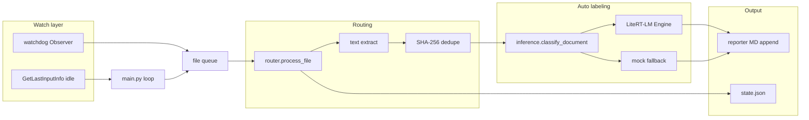

# ARCHITECTURE.md

DocuDog **Stage 1 (Watcher)** architecture, aligned with [master-plan.md](master-plan.md): idle-aware collection, routing, local LLM auto-labeling, local report output.

**Implemented capability inventory (review / changelog-oriented):** [docs/implemented-features.md](docs/implemented-features.md)

## Layout (Python)

- **`main.py`** at repo root is the **entry point** (run: `python main.py` from the repo root so `config.json` resolves).
- Library code lives in the **`docudog/`** package (`watcher`, `router`, `inference`, `config_loader`, …).

## High-level data flow

## Components

1. **`main.py`** — Loads `config.json`, expands paths, enforces run lock, applies background priority, runs `startup_model_probe`, starts observer, drains queue when user idle.
2. **`docudog/watcher.py`** — Recursive watch under configured roots; startup directory scan enqueues eligible files; idle polling for processing windows.
3. **`docudog/router.py`** — Extension/size filters, MVP skips (e.g. PDF/HWP without extractors), extracts text (txt/md/docx/pptx/xlsx), content-hash skip, appends report, updates state; invokes `docudog.inference`.
4. **`docudog/inference.py`** — Builds classification prompt; opens LiteRT-LM engine with configured max output tokens; parses/validates JSON; retry on schema failure; exposes `LiteRTInferenceError.stage` for failure localization.
5. **`docudog/env_litert.py`** — Sets TF/GLOG-related defaults before native load; **optional** stderr silencing via global `dup2` (`DOCUDOG_SILENCE_LITERT_STDERR=1`, **default off** — on some Windows + LiteRT builds, redirecting fd 2 breaks init/inference).
6. **`docudog/reporter.py` / `docudog/lineage.py`** — Human-readable audit trail; lineage map with **filename-key and/or fuzzy clustering** (stem + summary overlap, union-find) plus optional LLM hints.

## Configuration touchpoints

- **Watch**: `watch_settings`, `file_filters`, `idle_settings`
- **Storage**: `paths.state_path`, `paths.report_path`, run lock, optional `paths.audit_log_path`, `paths.tag_overrides_path` — owner overrides: [docs/owner-tag-overrides.md](docs/owner-tag-overrides.md)
- **Model**: `model.use_mock`, `model.litert_lm_bundle_path`, `model.litert_max_output_tokens`, `model.max_context_chars`, probe flags

## LiteRT-LM runtime fingerprint (verified)

Values below were captured on the reference Windows workstation via `python --version` and `pip show` (update this section if you change the environment).

| Item | Value |
|------|--------|
| **Python** | 3.13.13 |
| **litert-lm** (CLI meta-package) | 0.11.0 |
| **litert-lm-api** (`import litert_lm` — inference library) | 0.11.0 |
| **Upstream** | [google-ai-edge/LiteRT-LM](https://github.com/google-ai-edge/LiteRT-LM) |

**Bundle (DocuDog defaults):**

- **Hugging Face repo**: `google/gemma-3n-E2B-it-litert-lm` — [model page](https://huggingface.co/google/gemma-3n-E2B-it-litert-lm) (gated; license acceptance + auth required).
- **Example local file** (from `config.json`): `C:/mydev/DocuDog/models/gemma-3n-E2B-it-litert-lm/gemma-3n-E2B-it-int4.litertlm`
- **Download helper**: `python tools/download_litert_gemma.py` (default repo id matches the HF repo above).

### Version / compatibility notes

The **Hugging Face download / model page does not publish** an explicit compatibility matrix (e.g. supported Python minor versions, or a required `litert-lm-api` build per bundle revision). Treat **Python × wheel × `.litertlm` snapshot** as **best-effort** until confirmed.

For alignment, prefer the **LiteRT-LM** repository: release notes, README, and issues for Windows, `Engine(max_num_tokens=...)`, and tokenizer/context behavior rather than the HF UI alone.

## LiteRT-LM vs LiteRT C++ (`CompiledModel`)

DocuDog uses **LiteRT-LM**: a **higher-level** stack (Python `litert_lm`, **`.litertlm`** bundles, chat-style APIs, Gemma templates embedded in metadata). It is built on the same **LiteRT** ecosystem as edge TFLite-style runtimes, but **you do not call `CompiledModel::Create` or manage `TensorBuffer` directly** in this repo.

Google’s **LiteRT C++ “CompiledModel”** guide documents the **lower-level** API: `Environment`, `CompiledModel`, input/output `TensorBuffer`, `Run()` / `RunAsync()`, hardware accelerator selection, and **error handling via `litert::Expected`** (`LITERT_ASSIGN_OR_RETURN`, etc.).

Reference: [LiteRT CompiledModel C++ API](https://ai.google.dev/edge/litert/next/cpp?hl=ko)

### Why this matters for DocuDog

- Native logs or crashes (e.g. messages mentioning `Expected`, `HasValue`, `litert_expected`) come from **C++ LiteRT / LiteRT-LM internals**, not from Python code. Stderr stays enabled by default; interpret them with traceback mode for Python wrappers (`DOCUDOG_VERBOSE_INFERENCE=1`). Do not set `DOCUDOG_SILENCE_LITERT_STDERR=1` unless you accept possible LiteRT breakage on Windows.
- The C++ docs are most useful when **debugging the native stack**, choosing **CPU vs GPU/NPU**, or planning a **custom native integration**. They are **not** the primary integration surface for the current Python MVP.

## Do we need the Google LiteRT Git repository?

**For normal development and running DocuDog: no.** You consume **prebuilt** Python wheels (and possibly prebuilt native libs) for **LiteRT-LM**, plus a downloaded **`.litertlm`** bundle (e.g. via Hugging Face / project scripts).

**You might clone or build [LiteRT](https://github.com/google-ai-edge/LiteRT) from source if** you need to:

- Patch or inspect the native runtime at source level
- Build a custom configuration or platform not covered by published artifacts
- Contribute upstream or bisect a regression in the C++ layer

That is optional tooling, not a dependency of the Python orchestration code in this repo.

## Failure diagnosis (short)

| Symptom | Likely layer | First checks |
|--------|----------------|--------------|
| Mock results despite `use_mock: false` | Config / import / bundle path | `LLM probe` log line, `_docudog_inference_reason` in report |
| Python exception in `inference` | Python binding / usage | `DOCUDOG_VERBOSE_INFERENCE=1` |
| Process abort / `F0000` / `HasValue` | Native LiteRT | Leave `DOCUDOG_SILENCE_LITERT_STDERR` unset (default); bundle + wheel version match; `litert_max_output_tokens` |

## Roadmap context (master-plan)

Future pillars (lineage depth, shadow Git, vector store, server RAG, audit/DLP) extend this pipeline; current code implements the **Watcher + Auto labeling + local report** slice.
